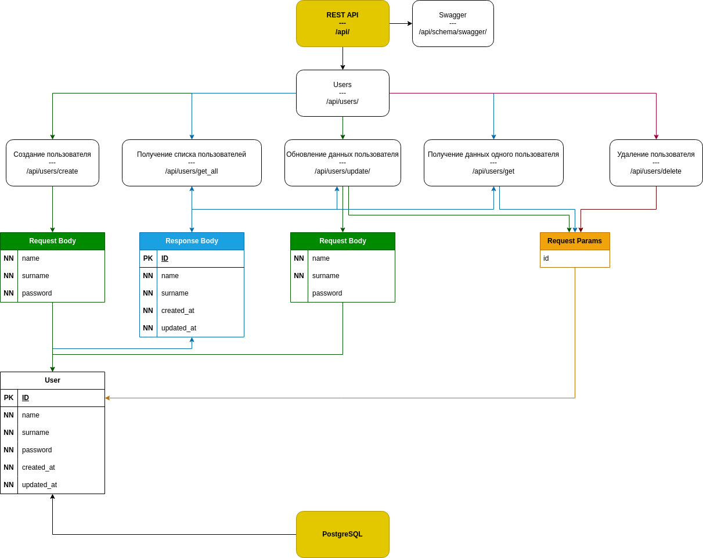

# Тестовое задание - [ТЗ](../data/TestTask.txt)<br />

REST API для управления пользователями

### Скачивание проекта
```bash
git clone \
  --single-branch \
  --depth=1 \
  https://github.com/ames0k0/TT--Litestar--User-Management

cd TT--Litestar--User-Management
```

### Запуску проекта через Docker Compose
<details>
  <summary>Зависимости</summary>
  <pre>
docker -v  # Docker version 27.5.1, build 9f9e405
python -V  # Python 3.12.3</pre>
</details>

```bash
docker compose up -d --build
```
| Сервис                     | Документация / SwaggerUI                 |
| -------------------------- | ---------------------------------------- |
| http://127.0.0.1:8884/api/ | http://127.0.0.1:8884/api/schema/swagger |


## REST API методы
#### Пользователь
- <details>
  <summary><strong>POST /api/users/create</strong> - Создание пользователя</summary>

  | Тело запроса        | Тип    | Описание                             |
  | ------------------- | ------ | ------------------------------------ |
  | name                | Строка | Имя пользователя                     |
  | surname             | Строка | Фамилия пользователя                 |
  | password            | Строка | Пароль пользователя                  |

  ```json
  {
    "created_at": "2025-04-16T08:43:53.315819Z",
    "updated_at": "2025-04-16T08:43:53.315824Z",
    "name": "string",
    "surname": "string",
    "id": 1
  }
  ```
  </details>

- <details>
  <summary><strong>POST /api/users/update</strong> - Обновление данных пользователя</summary>

  | Параметры запроса   | Тип    | Описание                             |
  | ------------------- | ------ | ------------------------------------ |
  | id                  | Число  | Идентификатор пользователя           |

  | Тело запроса        | Тип    | Описание                             |
  | ------------------- | ------ | ------------------------------------ |
  | name                | Строка | Имя пользователя                     |
  | surname             | Строка | Фамилия пользователя                 |
  | password            | Строка | Пароль пользователя                  |

  ```json
  {
    "created_at": "2025-04-16T08:43:53.315819Z",
    "updated_at": "2025-04-16T08:51:44.227104Z",
    "name": "John",
    "surname": "Doe",
    "id": 1
  }
  ```
  </details>

- <details>
  <summary><strong>GET /api/users/get</strong> - Получение данных одного пользователя</summary>

  | Параметры запроса   | Тип    | Описание                             |
  | ------------------- | ------ | ------------------------------------ |
  | id                  | Число  | Идентификатор пользователя           |

  ```json
  {
    "created_at": "2025-04-16T08:43:53.315819Z",
    "updated_at": "2025-04-16T08:51:44.227104Z",
    "name": "John",
    "surname": "Doe",
    "id": 1
  }
  ```
  </details>

- <details>
  <summary><strong>GET /api/users/get_all</strong> - Получение списка пользователей</summary>

  | Параметры запроса   | Тип    | Описание                             |
  | ------------------- | ------ | ------------------------------------ |
  | id                  | Число  | Идентификатор пользователя           |

  ```json
  [
    {
      "created_at": "2025-04-16T08:43:53.315819Z",
      "updated_at": "2025-04-16T08:51:44.227104Z",
      "name": "John",
      "surname": "Doe",
      "id": 1
    }
  ]
  ```
  </details>

- <details>
  <summary><strong>DELETE /api/users/delete</strong> - Удаление пользователя</summary>

  | Параметры запроса   | Тип    | Описание                             |
  | ------------------- | ------ | ------------------------------------ |
  | id                  | Число  | Идентификатор пользователя           |

  </details>

### Остановка проекта и удаление:
- Docker-контейнеров
- хранилище
- сети

```bash
docker compose down --volumes
```

---

<details>
<summary>Файловая структура проекта</summary>

```bash
tree -a -I ".git|__pycache__|pgdata|data|alembic" --dirsfirst
```
<pre>
.
├── src
│   ├── core
│   │   ├── config.py
│   │   ├── exceptions.py
│   │   └── __init__.py
│   ├── routes
│   │   ├── users
│   │   │   ├── __init__.py
│   │   │   ├── models.py
│   │   │   ├── repository.py
│   │   │   └── schemas.py
│   │   └── __init__.py
│   └── __init__.py
├── alembic.ini
├── docker-compose.yml
├── Dockerfile
├── .dockerignore
├── .env
├── .gitignore
├── main.py
├── poetry.lock
├── pyproject.toml
└── README.md
</pre>
</details>

<details>
<summary>Использованные технологии</summary>

| Название         | Ссылка                                             |
| ---------------- | -------------------------------------------------  |
| Litestar         | https://litestar.dev/                              |
| litestar-asyncpg | https://github.com/litestar-org/litestar-asyncpg   |
| advanced-alchemy | https://docs.advanced-alchemy.litestar.dev/latest/ |
| msgspec          | https://jcristharif.com/msgspec/                   |
| python-dotenv    | https://pypi.org/project/python-dotenv/            |
| PostgreSQL       | https://www.postgresql.org                         |
| Docker           | https://docs.docker.com                            |
| Docker Compose   | https://docs.docker.com/compose                    |

</details>

---
<p align="center"></p>